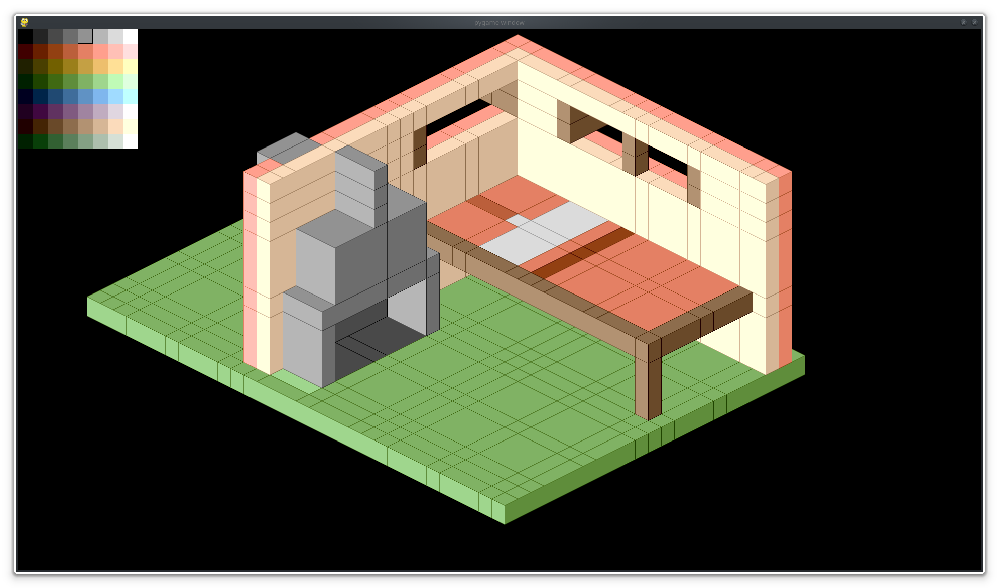

# Voxeldraw
Small voxel drawing program, rendered in classic isometric view. Using pygame.

Use left button to either colorise or plot, use right button to remove.  
Use middle button to colorpick. Scroll wheel scrolls in 4 directions, or with CTRL zooms in and out.

Use left and right arrow to rotate model in 90 degree increments, and use N and M to mirror it.

Should save to local folder, launch program with file as first argument to load the model.

## Grid system

I had a bit of fun coming up with an unique grid system.  
It repeats every 6x6x6 voxels, but the order is a 3x3x3 "pillar" followed by a large "wall", followed by a 1 block wide "pillar" followed by another "wall".

## Palette

The palette I stole from another project of mine, it ain't great for this kind of application but that's a worry for later.
